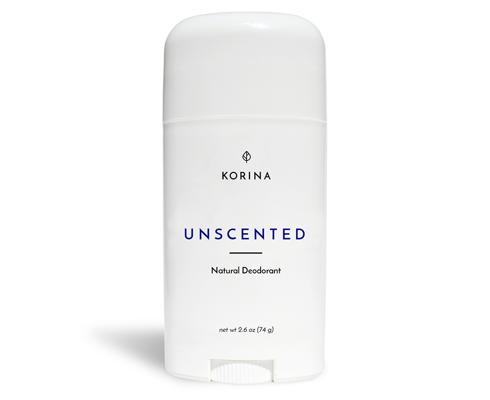

# Zero Bad Deodorant
Deodorant that isn’t a chemistry experiment

## ALUMINUM FREE
Zero Bad Deodorant isn’t a chemistry experiment, and is made without aluminum, parabens, phthalates, and talc.

## FREE SHIPPING
Get free shipping on every order. If you don’t love our deodorant, we’ll give you a full refund. No questions asked.

## EFFECTIVE PROTECTION
We tested thousands of ingredients before finding a recipe that feels light and fresh under your arms, but provides you with effective protection against odor and wetness.

## GOES ON EASY
Zero Bad Deodorant is a solid deodorant that you can apply easily. Since the deodorant doesn’t contain aluminum, it won’t stain your clothes.

## 👉 BUY
**if you're interested please send us an <a target="_blank" href="mailto:krumhausen+zerobad@gmail.com?subject=Hi">email</a>.**
